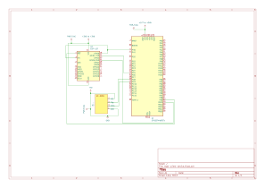

## Hardware Setup for Integration Test
The electrical schematic diagrams below show hardware wiring which matchs software configuration, jump to the embedded development board you use and following the setup to get the entire application system up and running.

### Source of Randomness
Note: In these test applciations, I use HC-SR04 sonar sensor to generate random signals. If you have more advanced experience with electronics, there may be simpler ways to achieve the same result.

### ESP8266-AT-Parser
#### STM32F446 MCU board + ESP-12s

